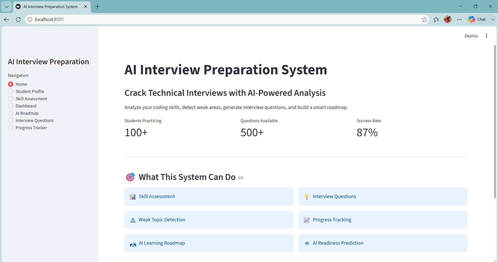
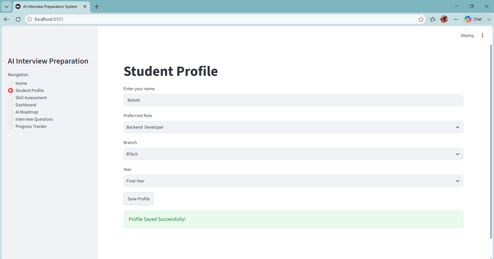
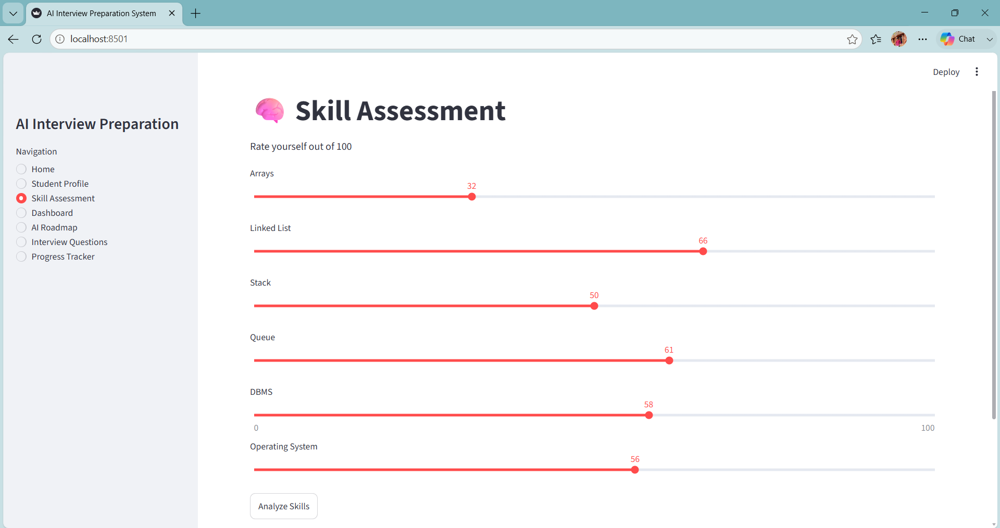
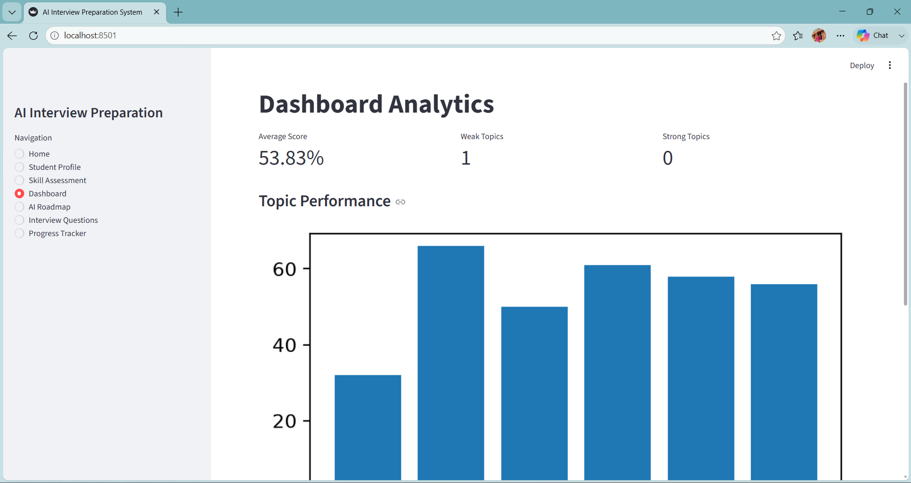
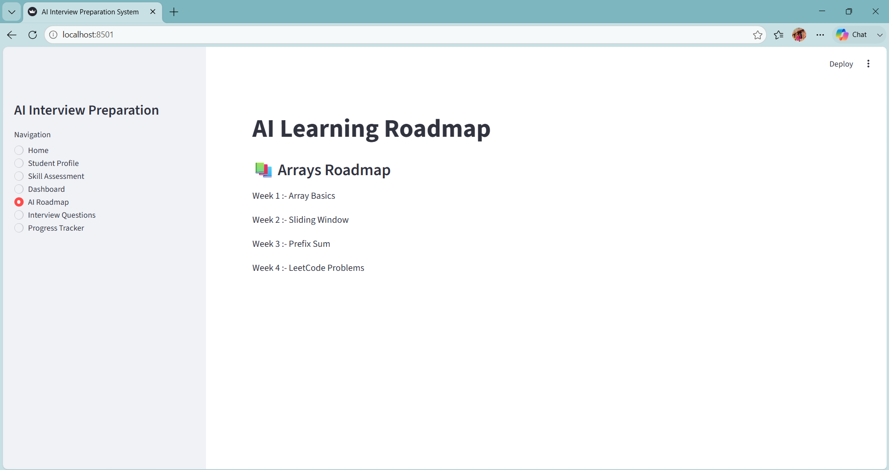
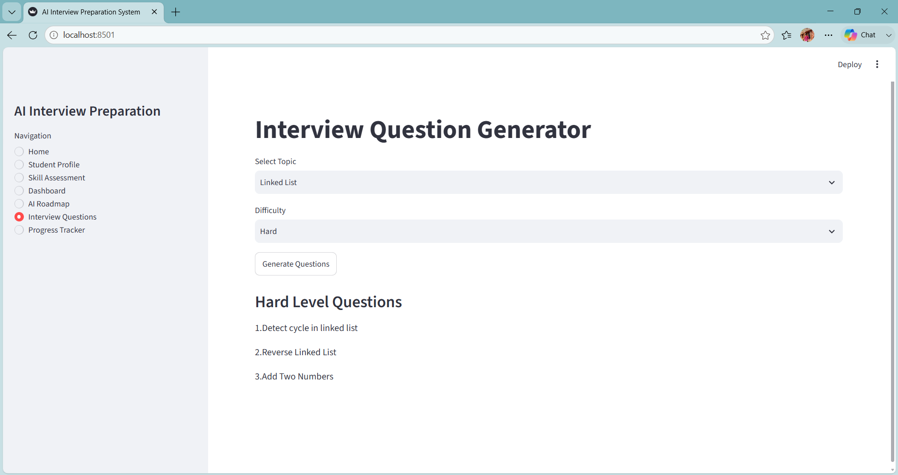
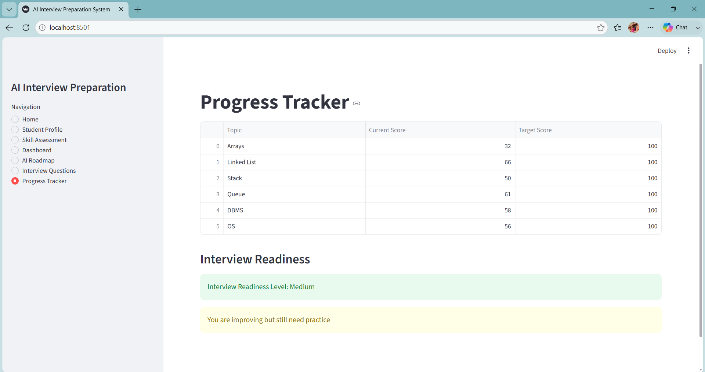

   🤖 AI Interview Preparation System

🌐 Live Demo: https://your-streamlit-app.streamlit.app

💻 GitHub Repository: https://github.com/roh78/AI_INTERVIEW

---

📸 Application preview

  🏠 Home Dashboard

---

  👤 Student Profile

---

  📊 Skill Assessment

---

  📈 Dashboard Analytics

---

  🛣️ AI Learning Roadmap

---

  💡 Interview Questions

---

  📈 Progress Tracker

---

  🚀 Features

  
    AI-powered interview questions
    Student profile
    Skill assessment
    Learning roadmap
    Progress tracker
    Dashboard analytics
    Dark theme UI

---

  🛠️ Tech Stack

    Python
    Streamlit
    Pandas
    JSON
    Git & GitHub

---

  📂 Folder Structure

 
    AI_INTERVIEW/  
    │── images 
    │── app.py
    │── questions.json
    │── requirements.txt
    │── README.md

---

  🌟 Future Enhancements
     
     
    User Login & Authentication
    AI Resume Analyzer
    Voice Interview
    Chatbot Assistant
    Database (SQLite/MySQL)
    Leaderboard
    PDF Report Generation
    OpenAI/Gemini integration

---